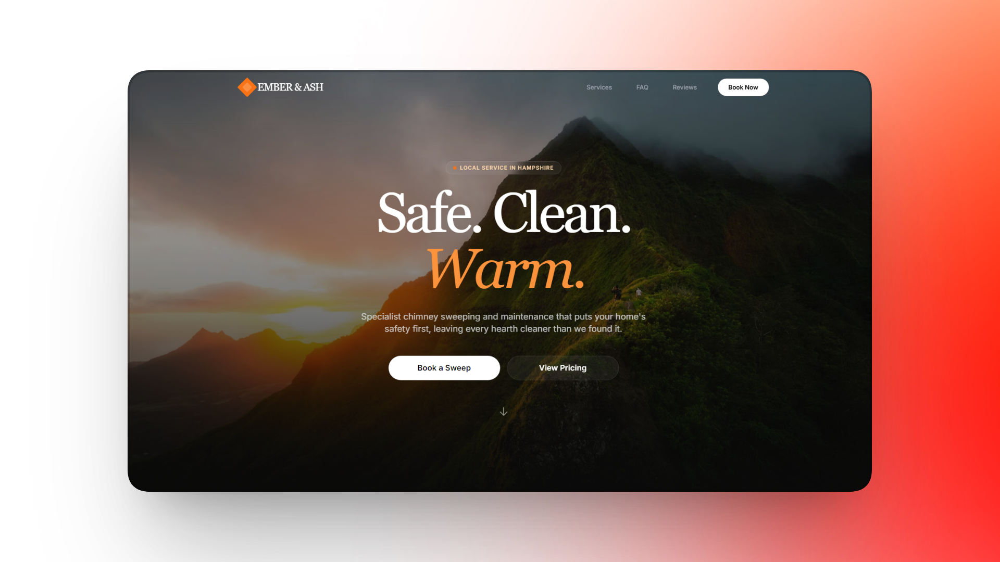
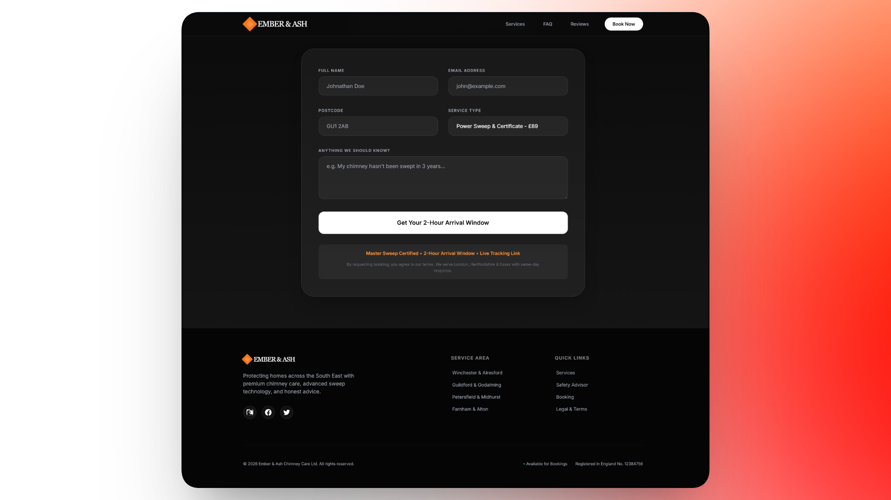
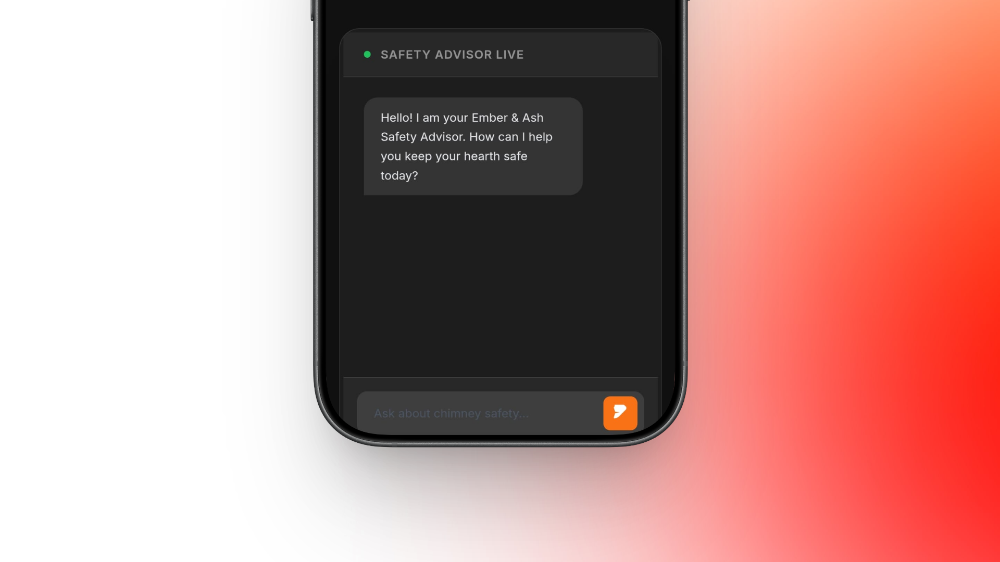

# Ember & Ash Chimney Care

A premium, design-focused chimney sweep website featuring a stunning hero experience, AI-powered safety advisor, and seamless booking system.

## Live Demo

**View the website:** [DEMO LINK](https://ionutrobert.github.io/ember-ash-chimney-care/)

---

## Features

- **Stunning Visual Design** — Dark, elegant theme with sophisticated typography and smooth animations
- **AI Safety Advisor** — Interactive chatbot answering chimney safety questions in real-time (requires Gemini API key)
- **Service Showcase** — Beautiful service cards with transparent pricing
- **Customer Testimonials** — Social proof with authentic reviews
- **Booking System** — Integrated booking form with service selection
- **Fully Responsive** — Looks great on all devices

---

## Screenshots

### Booking Form

### Services

### AI Chat Experience

---

## Technology

- React 19
- TypeScript
- Vite
- Tailwind CSS
- Google Gemini API (optional)
- HTML, CSS, and JavaScript version included

---

## Deployment

This project is ready for GitHub Pages deployment:

1. Push to GitHub
2. Go to **Settings → Pages**
3. Select **Deploy from a branch** → **main** → **/dist**

---

## Customization

Want a similar website for your business? This template can be customized with your brand, services, and contact information.

**Contact:** [ionutrobertbalasoiu@gmail.com](mailto:ionutrobertbalasoiu@gmail.com)
